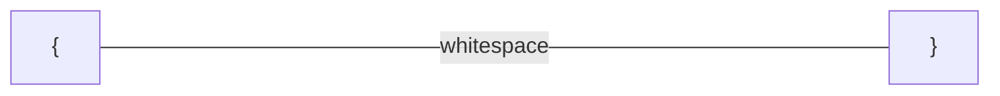
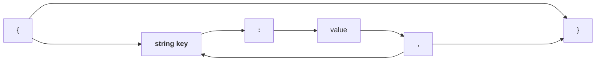
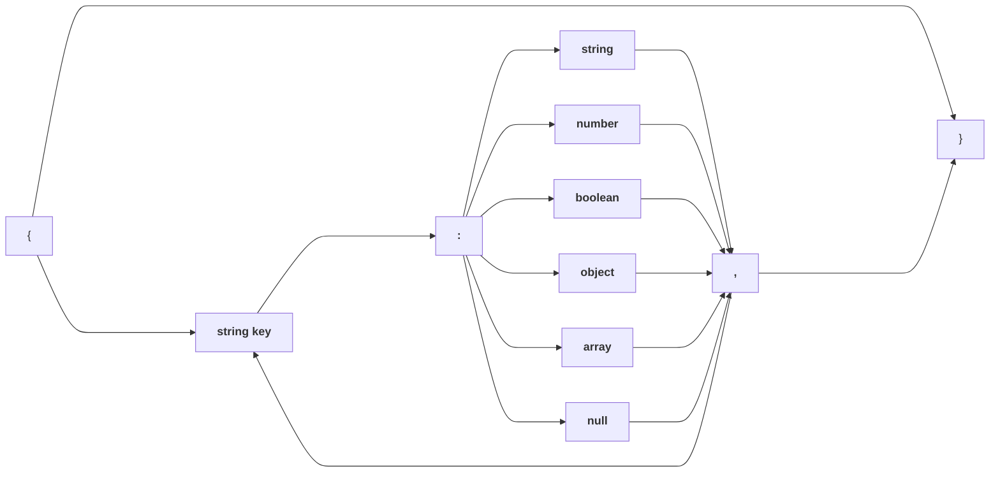

```mermaid {scale: 0.8}
flowchart LR
   a["{"]
   b["}"]

   a --------------|whitespace| b
```

```mermaid {scale: 0.8}
flowchart LR
   a["{"]
   b["}"]
   d[<b>:</b>]
   v[value]
   km[<b>,</b>]
   k[<b>string key</b>]


   a ------> k
   km ---> k
   d ---> v
   a -------> b
   k ---> d
   v ---> km
   km -------> b
```

```mermaid {scale: 0.8}
flowchart LR
   a["{"]
   b["}"]
   d[<b>:</b>]
   k[<b>string key</b>]
   s[<b>string</b>]
   km[<b>,</b>]
   nu[<b>number</b>]
   bl[<b>boolean</b>]
   o[<b>object</b>]
   ar[<b>array</b>]
   n[<b>null</b>]

   a -----> b

   a -----> k

   k -----> d

   d ---> s
   s ---> km

   d ---> nu
   nu ---> km
   
   d ---> bl
   bl ---> km
   
   d ---> o
   o ---> km
   
   d ---> ar
   ar ---> km
   
   d ---> n
   n ---> km

   km ------> b
   km -----> k
```

